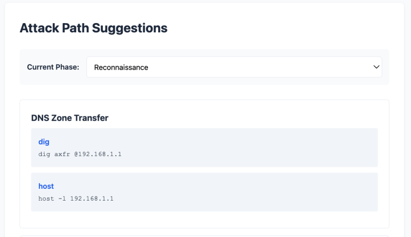

# recon2report ⓡ②ⓡ


Better pentesting, from reconnaissance to reporting.

## Project Purpose

recon2report transforms Nmap scan results into context-aware penetration testing commands. The system automatically suggests relevant attack vectors based on detected services, current penetration testing phase, and acquired access.

**Phase 1 Scope**: CLI and web UI workflows with intelligent attack path suggestions. All data is stored in-memory (no persistence). Future phases will add persistent storage and report generation.

## Getting Started

### Option 1: Web Interface (Recommended)

1. Start the API:
   ```bash
   dotnet run --project R2R.Api
   ```
   API runs on `http://localhost:5258`

2. Start the web frontend (in a separate terminal):
   ```bash
   cd R2R.Web
   npm install
   npm run dev
   ```
   Web UI opens at `http://localhost:5173`

3. Use the browser interface to:
   - Create sessions and targets
   - Get Nmap scan suggestions
   - Paste scan results
   - View parsed ports from multiple hosts
   - Explore attack vectors by phase

### Screenshots:

#### Session creation and Nmap suggestions


#### Multi-host scan results with nested ports


#### Phase-based attack suggestions


### Option 2: CLI Workflow

1. Start the API in one terminal:
   ```bash
   dotnet run --project R2R.Api
   ```
   
2. Launch the CLI in a separate terminal:
   ```bash
   dotnet run --project R2R.Cli
   ```

3. Follow the prompts to create a session, run Nmap scans, and get attack suggestions.

All data lives in memory; restarting the API clears it.

## Attack Path System

The system uses **service-based JSON files** in `/services/` to define attack paths dynamically. This allows you to maintain attack techniques without changing code, with better organization and performance.

### How It Works
1. **Nmap scan** detects open ports and services on target
2. **Port-to-service mapping** loads only relevant JSON files
   - Port 445 → Load `smb.json`
   - Port 80/443 → Load `http.json`
   - Port 389 → Load `active-directory.json`
   - Always load `network-general.json`
3. **Rule engine** filters vectors by:
   - **Phase** (reconnaissance → credential_access → lateral_movement → privilege_escalation → persistence)
   - **Prerequisites** (what you've already obtained)
   - **Target OS** (Windows/Linux/Any)
4. **Variable substitution** fills in `<ip>`, `<domain>`, `<ip_range>` placeholders with real values

### Service-Based Architecture

Attack vectors are organized by service/protocol rather than by phase:

```
services/
├── Network Services
│   ├── smb.json          # SMB/CIFS attacks (ports 445, 139)
│   ├── http.json         # Web attacks (ports 80, 443, 8080)
│   ├── dns.json          # DNS attacks (port 53)
│   ├── ldap.json         # LDAP attacks (ports 389, 636)
│   ├── kerberos.json     # Kerberos attacks (port 88)
│   ├── ssh.json          # SSH attacks (port 22)
│   ├── rdp.json          # RDP attacks (port 3389)
│   ├── winrm.json        # WinRM attacks (ports 5985, 5986)
│   ├── ftp.json          # FTP attacks (port 21)
│   └── network-general.json  # Network-level attacks
│
├── Active Directory
│   ├── active-directory.json  # ACLs, delegation, trusts
│   ├── adcs.json              # Certificate Services (ESC1-ESC15)
│   └── sccm.json              # SCCM/MECM exploitation
│
├── Windows
│   ├── windows-admin.json      # Credential extraction
│   ├── windows-privesc.json    # Local privilege escalation
│   └── windows-persistence.json # Persistence mechanisms
│
└── Techniques
    ├── vulnerabilities.json     # Known CVE exploits
    ├── password-cracking.json   # Hash cracking
    └── ntlm-relay.json          # NTLM relay attacks
```

### JSON Schema

Each service file follows this structure:

```json
{
  "service": "smb",
  "description": "SMB/CIFS attacks for Windows file sharing",
  "ports": [139, 445],
  "serviceNames": ["microsoft-ds", "netbios-ssn"],
  "targetOs": ["windows"],
  "vectors": [
    {
      "id": "smb-anonymous-enum",
      "name": "Anonymous SMB Enumeration",
      "phase": "reconnaissance",
      "prerequisites": ["network_access"],
      "description": "Enumerate SMB shares without authentication",
      "commands": [
        {
          "tool": "smbclient",
          "command": "smbclient -L //<ip> -N",
          "description": "List SMB shares anonymously"
        }
      ],
      "outcomes": ["information_gathered"]
    }
  ]
}
```

### Example: HTTP-Only Host

**Scenario**: Nmap detects ports 80 and 443 open

**System loads**: `http.json`, `network-general.json` (only 2 files instead of all services)

**Filters by phase**: `reconnaissance` (initial stage)

**Returns vectors**:
- Web Service Discovery
- Directory Bruteforcing  
- Vulnerability Scanning
- Network Discovery
- LLMNR Poisoning


### Kill Chain Phases

Attack paths follow standard penetration testing methodology:

1. **reconnaissance** - Initial discovery, no credentials required
2. **credential_access** - Obtaining credentials (bruteforce, poisoning, etc.)
3. **lateral_movement** - Moving through network with valid credentials
4. **privilege_escalation** - Elevating privileges
5. **persistence** - Maintaining access

### Benefits

-  **Simple Logic** - No complex port filtering in code, just load relevant files
-  **Fast Performance** - Only parse 2-4 relevant services instead of all attack vectors
-  **Easy Maintenance** - All SMB attacks in one place, edit JSON without touching code
-  **Accurate Filtering** - Port-based loading prevents irrelevant suggestions
-  **Machine Readable** - JSON is structured, parseable, and efficient
-  **Clear Dependencies** - Prerequisites explicitly defined in each vector

## API Surface
| Method & Path            | Description                                              |
| ------------------------ | -------------------------------------------------------- |
| `POST /sessions`         | Creates a new recon session.                             |
| `GET /sessions/{id}`     | Fetches a previously created session.                    |
| `DELETE /sessions/{id}`  | Removes a session (and implicitly its targets).          |
| `POST /targets`          | Adds a target tied to a session.                         |
| `GET /targets/{id}`      | Retrieves target metadata.                               |
| `PUT /targets/{id}`      | Updates target details.                                  |
| `DELETE /targets/{id}`   | Deletes a target.                                        |
| `POST /targets/{id}/scan`| Uploads and stores parsed Nmap scan results for a target.|
| `GET /targets/{id}/scan` | Retrieves stored scan results for a target.              |
| `POST /nmap/suggest`     | Returns curated Nmap commands for the given IP/OS.       |
| `POST /nmap/parse`       | Parses Nmap "normal" output into `OpenPort` records.     |
| `POST /attack-paths/suggest` | **NEW**: Suggests attack vectors based on current phase, ports, and services using markdown rule sets. |

## Running Tests
```bash
dotnet test
```

## Project Layout
```
R2R.Api/                  Minimal API (endpoints + helpers)
R2R.Cli/                  Console workflow client
R2R.Web/                  Static web frontend (Vite + Vanilla JS)
  ├── index.html         Single-page application
  ├── main.js            Application logic and API integration
  ├── style.css          Custom styling
  └── package.json       Vite dev server
R2R.Core.Domain/          Domain models (AttackVector, Command, Outcome, ServiceRuleSet, AttackState)
R2R.Core.Parsing/         JSON parser for service rule files
R2R.Core.Rules/           Service-aware rule engine for evaluating attack states
R2R.Tests/                xUnit test project
services/                 JSON files defining service-based attack vectors
  ├── smb.json           SMB/CIFS attacks
  ├── http.json          Web application attacks
  ├── active-directory.json  AD attacks (ACLs, delegation, trusts)
  ├── adcs.json          Certificate Services attacks
  ├── vulnerabilities.json   Known CVE exploits
  └── ...                19 service files total
adrs/                     Architecture Decision Records
  ├── 0000-architecture-overview.md
  ├── 0001-adding-services.md
  └── 0002-web-frontend.md
```

## Troubleshooting
- **403 from CLI**: Ensure the API is running and that `R2R_API_BASE` matches its URL (defaults to `http://localhost:5258/`).
- **CORS errors in browser**: Verify the API is running with CORS enabled for `http://localhost:5173`.
- **Web UI not loading**: Run `npm install` in `R2R.Web/` first, then `npm run dev`.
- **Swagger/Swashbuckle build errors**: The project relies on `Microsoft.AspNetCore.OpenApi` only; make sure no other Swagger packages are referenced.
- **dotnet test errors**: Confirm the API project builds; missing types are usually due to visibility changes in `Program.cs`.

## License

This project is licensed under the **Business Source License 1.1 (BSL)**. See [LICENSE](./LICENSE) for full text.

**Summary**:
- Free for testing, development, and educational use
- Free for penetration testing labs and CTF competitions
- NOT for production use without a commercial license
- Converts to Apache 2.0 license after 4 years

## Safety Warning

**FOR AUTHORIZED TESTING ONLY**

This tool is designed for:
- Penetration testing labs (HackTheBox, TryHackMe, OSCP)
- CTF competitions
- Security research and education
- Authorized penetration testing engagements with written permission

**NEVER use this tool against systems you don't own or have explicit written permission to test.** Unauthorized access to computer systems is illegal.
